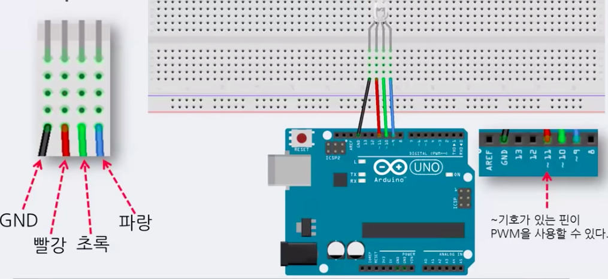
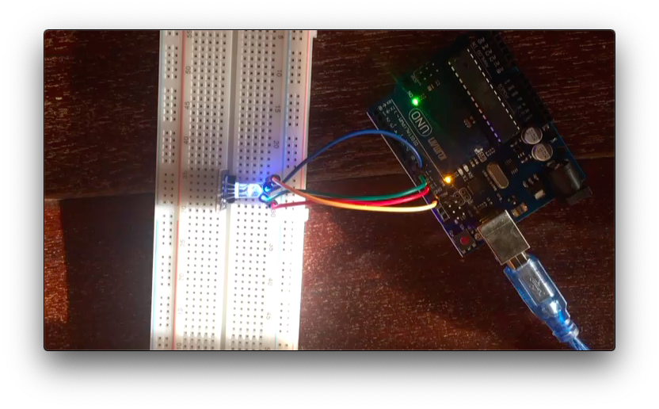

# RGB control

### # material

- 1 LED (RGB)


### # theory




### # image



### # video

<video src="RGB_control.mp4"></video>


### # code

```c
#define RED 11
#define GREEN 10
#define BLUE 9

void setup(){
  // random number
  // anlog(0) : initialize randome number (0~1023)
  // because floating status, it becomes randome number
  randomSeed(analogRead(0));
}

void loop(){
  // 0 <= num < 255(2^8)
  // 2^8* 2^8 *2^8 
  analogWrite(RED,random(225));
  analogWrite(GREEN,random(225));
  analogWrite(BLUE,random(225));
  delay(1000); //1 sec
}
```


