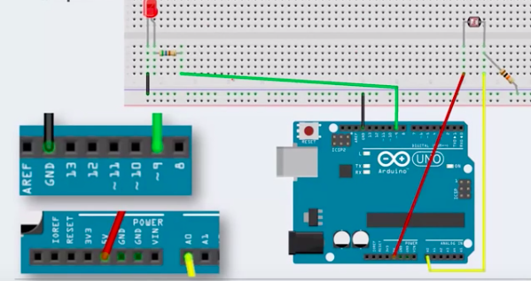
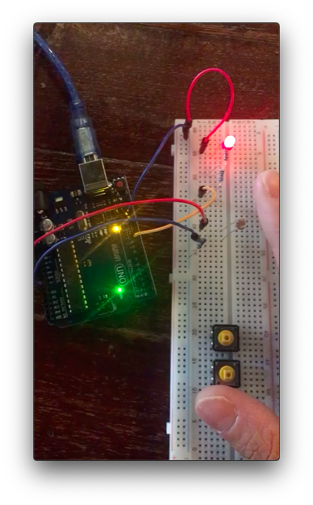

# LIGHT sensor and LED

### # material

- 1 LED (RGB)
- 1 light sensor 


### # circuit & theory 



- more light -> less R
- Light is analog value -> use analog pin A0


### # image



### # video

<video src="LightSensor_LED.mp4"></video>


### # code

```c
void setup(){
}

void loop(){
  analogWrite(9,map(analogRead(A0),0,1023,0,255));
  
  // analogRead(A0) : read the analog value of A0
  // and convert and take at 9
  
  // reading value of anlalog to Digital(LED,255)
  //  MAP : change the value in a range to new value in other range
  // A0 ( 0~1023) --> (0~255)
  // A0, analog, 10bit, 2^10, 1024 ,light sensor
  // new, digital,
}
```


