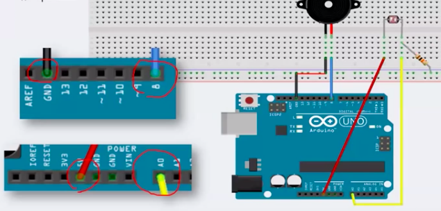
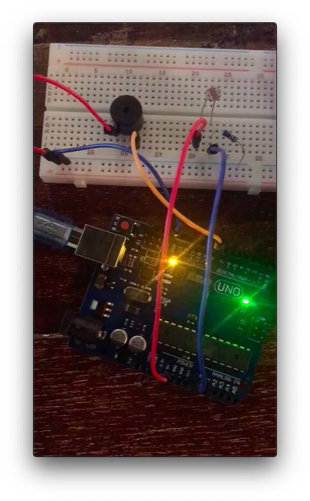

# LIGHT sensor and Buzzer

### # material

- 1 Buzzer
- 1 light sensor 


### # circuit & theory 



- less light -> more R -> high sound


### # image



### # video

<video src="lightsensor_buzzer.mp4"></video>


### # code

```c
void setup(){
}

void loop(){
  tone(8,map(analogRead(A0),0,1023,31,4978),20);
  delay(500);
  
  // Buzz sound range : 31~4978
  // read A0 value(light)
  // convert from light value(analog) to Buzzer value and put to 8
  // every 0.5 sec
  
}
```


