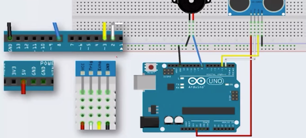

# ultrasound SenSor And Buzzer

### # material

- 1 Buzzer
- 1 ultrasound SenSor


### # circuit & theory 




### # video

<video src="ultrasound_buzzer.mp4"></video>

### # code

```c
#define TRIG 2
#define ECHO 3

void setup(){
  pinMode(TRIG, OUTPUT);
  pinMode(ECHO, INPUT);
}

void loop(){
  // takes phyical time to turn on, off ->calibration
  digitalWrite(TRIG,LOW);
  delayMicroseconds(2);
  digitalWrite(TRIG,HIGH);
  delayMicroseconds(10);
  digitalWrite(TRIG,LOW);
  
  // ultrawave distance to Centimeter
  // check ultrawave distance of pin2 when its high
  long distance = pulseIn(ECHO,HIGH) / 58.2;
  
  tone(8,1000,20);
  delay(100);
  tone(8,1000,20);
  
  delay(distance);


}
```


