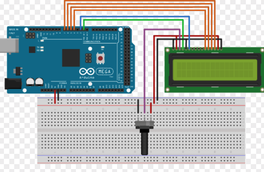
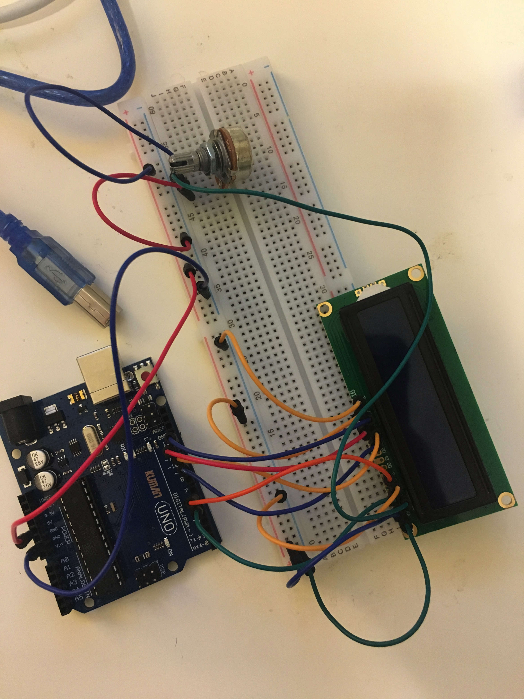

# LCD

### # material

- 1 LCD
- 1 Variable resistor


### # circuit & theory 




### # image 




### # code

```c
#include <LiquidCrystal.h>

// LiquidCrystal class initiate
// LiquidCrystal : library initialize commoan
LiquidCrystal lcd(5,6,10,11,12,13);
                // RS E D4 D5 D6 D7

void setup(){
  //let it know 16 x 2 (depends on LCD)
  lcd.begin(16,2);
  //print
  // lcd.print("Hello World");
}

void loop(){
  //LCD has 2 row and 16 column
  // 0,1 -> 1st line, 2nd column
  // lcd.setCursor(0,1);
  // print light sensor value
  // lcd.print(analogRead(A0));
  // delay(200);
  
  lcd.setCursor(0,1);
  lcd.print("Hello!");

}
```


