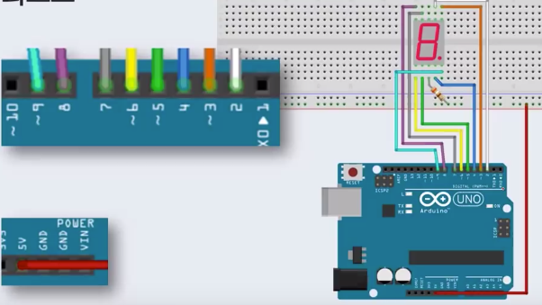
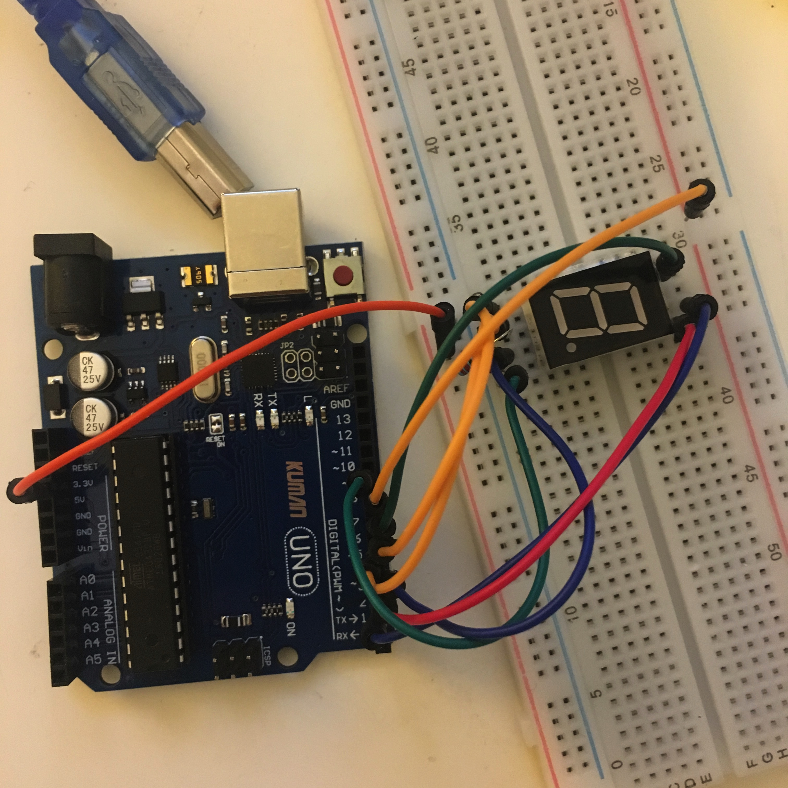

# 7 segment

### # material

- 1 7segment
- 1 Variable resistor


### # circuit & theory 




### # image 




### # code

```c
byte digits[10][7] = 
//0~255 2 dimensional
{
  {0,0,0,0,0,0,1}, //0
  {1,0,0,1,1,1,1}, //1
  {0,0,1,0,0,1,0},
  {0,0,0,0,1,1,0},
  {1,0,0,1,1,0,0}, //4
  {0,1,0,0,1,0,0},
  {0,1,0,0,0,0,0},
  {0,0,0,1,1,1,1}, //7
  {1,0,0,0,0,0,0},
  {0,0,0,1,1,0,0}
};

void setup(){
  for(int i = 2; i<10; i++){
    pinMode(i,OUTPUT);
  }
  digitalWrite(9,HIGH); //DP LED off .(dot)
}

void loop(){
  for(int i = 0; i<10; i++){
    delay(1000);
    displayDigit(i);
  }
}

void displayDigit(int num){
  int pin = 2;
  for(int i =0; i<7; i++){
    digitalWrite(pin+i,digits[num][i]);
  }
}

```


